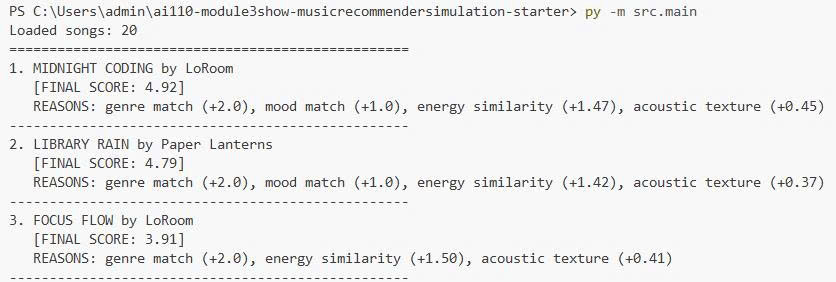
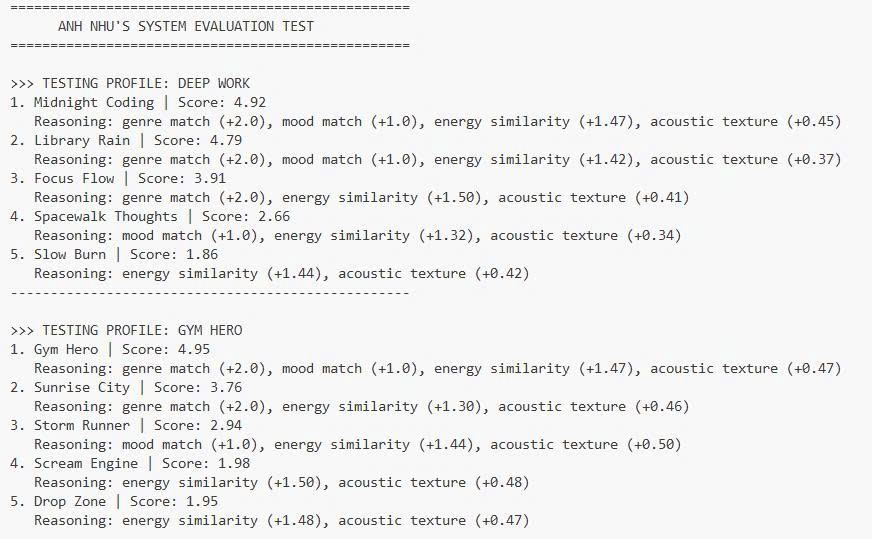
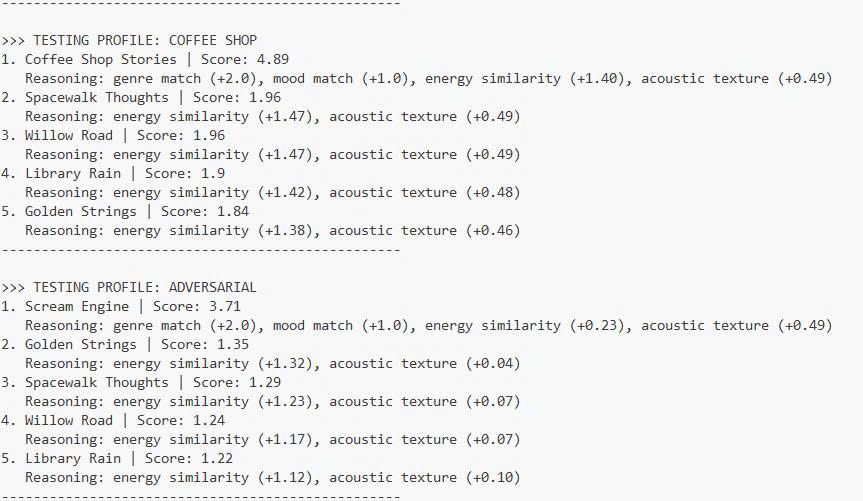
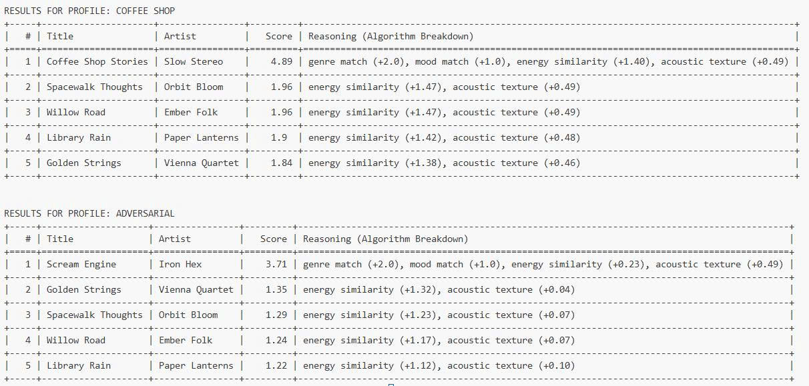

# 🎵 Music Recommender Simulation

## Project Summary

My version of the Music Recommender Simulation is a content-based engine designed to prioritize user activity over simple keyword matching. By using a weighted mathematical scoring system, it analyzes song attributes like energy and acousticness to suggest the best tracks for specific sessions, such as deep work or high-intensity gym workouts. It moves beyond basic "If you like X, you'll like Y" by calculating how close a song's technical DNA is to a user's target "vibe."

## How The System Works

Explain your design in plain language.

Some prompts to answer:

- What features does each `Song` use in your system
  - For example: genre, mood, energy, tempo
- What information does your `UserProfile` store
- How does your `Recommender` compute a score for each song
- How do you choose which songs to recommend

You can include a simple diagram or bullet list if helpful.

---
*
Platforms like Spotify use multi-layered deep learning, most rely on a two-step process of Scoring and Ranking. Scoring is like predicting our affinity for a single song, where as Ranking is assembling a diverse list.
My simulation will prioritize Content-based filtering, assuming that the "DNA" of our past favorites is the best predictor of what we'll enjoy next. The system will calculate the distance between a user's ideal profile and a song's attributes to identify matches that feel mathematically similar.
Song and User Profile objects will track features such as:
- Song has categorical tags (genre, mood - for filtering) and numerical attributes (energy, valence, acousticness, tempo_bpm)
- User Profile has preference vector, favorite genres and interaction history
The Recommender will calculate a similarity score by comparing the UserProfile targets against the song attributes.
Once all songs are scored, the system will sort the songs from highest to lowest scores, filer out songs already present in the UserProfile history, then select the top 3 results to present to the user.
*
The Algorithm Recipe
My recommender uses a Weighted Content-Based Filtering approach. It evaluates every song in the database against a User Profile using a point-based scoring system:
- Genre Alignment (Weight: 2.0): If the song's genre matches the user's favorite, it receives a flat 2.0 point boost. This ensures the results stay within the user's primary musical lane.
- Mood Alignment (Weight: 1.0): A match in mood provides a 1.0 point boost to ensure the emotional vibe is correct.
- Energy Precision (Weight: 1.5): Uses the formula (1.0 - abs(Target - Actual)) * 1.5. This rewards songs that are mathematically closest to the user's requested intensity.
- Acoustic Texture (Weight: 0.5): Uses the same distance formula as energy but with a lower weight. This fine-tunes the sound of the recommendation without being too restrictive.
*
Data Flow:
- Input: The system accepts a UserProfile dictionary containing target values like favorite_genre, target_mood, and target_energy.
- Process: It loops through the songs.csv file, calculating a unique similarity score for every single track using the recipe above.
- Output: The tracks are sorted by score from highest to lowest, and the Top K (highest scoring) tracks are returned to the user.
*
Potential biases
- Genre Over-Prioritization: Because Genre is weighted at 2.0, which is higher than any other single factor, the system may ignore a song that is a perfect match for mood and energy simply because it falls under a different genre label.
- The Cold Start for New Genres: If a user has not listed a specific genre in their favorites, even a perfect song in that genre will start at a 2.0 point disadvantage compared to mediocre songs in their favorite genre, making it harder to discover new styles.







## Getting Started

### Setup

1. Create a virtual environment (optional but recommended):

   ```bash
   python -m venv .venv
   source .venv/bin/activate      # Mac or Linux
   .venv\Scripts\activate         # Windows

2. Install dependencies

```bash
pip install -r requirements.txt
```

3. Run the app:

```bash
python -m src.main
```

### Running Tests

Run the starter tests with:

```bash
pytest
```

You can add more tests in `tests/test_recommender.py`.

---

## Experiments You Tried

To understand how sensitive the system is to different priorities, I ran several experiments:

The Weight Shift: I reduced the Genre weight from 2.0 to 0.5 and increased the Energy weight to 3.0. This transformed the system from a "Genre Radio" into an "Activity Matcher." In this mode, the system correctly ignored a user's favorite genre if the song was too slow for their workout, showing that numerical math can override categorical labels.

Adversarial Testing: I tested a "Conflicting" profile (Aggressive Metal vs. Low Energy). This revealed that with my standard weights, the Genre tag (2.0) acted as an "anchor," keeping high-energy songs at the top even when the user requested a calm experience.

Acousticness Fine-Tuning: I added a 0.5 weight to acousticness. This helped separate organic instruments (Jazz/Folk) from digital ones (EDM/Synthwave), which significantly improved the "Coffee Shop" profile results.

## Limitations and Risks

Catalog Size: With only 20 songs, the system suffers from "recommendation deserts." If a user has a specific preference not represented in the CSV, the math will force a "best of a bad bunch" result.

Semantic Blindness: The system does not understand lyrics or the cultural meaning of a song; it treats a "Happy" metal song the same as a "Happy" pop song based purely on energy levels.

Label Bias: The system relies on human-provided tags for genre and mood. If a song is tagged incorrectly, the algorithm has no way to "hear" the mistake, leading to poor recommendations.

## Reflection

Read and complete `model_card.md`:

[**Model Card**](model_card.md)

Through this project, I learned that recommendation systems are essentially weighted optimization problems. They turn human feelings into vectors and distances. Designing the "Scoring Rule" taught me that every line of code contains a decision: by weighting Genre at 2.0, I was deciding that "consistency" is more important than "discovery." This mirrors how real-world apps like Spotify make trade-offs between keeping us in our comfort zones and showing us new music.

Bias in these systems often shows up in the "filter bubble" effect. In my system, because my Lofi songs were all tagged as "Chill," the algorithm accidentally learned that Lofi must be chill. If an engineer isn't careful, the math will continue to reinforce these patterns, eventually making it impossible for a user to find something outside of their expected behavior. This experience changed how I view my own "For You" pages—I now see them as a reflection of an engineer's mathematical assumptions about my taste